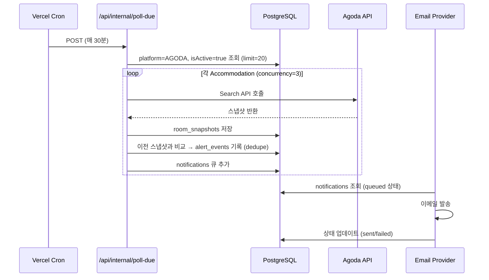
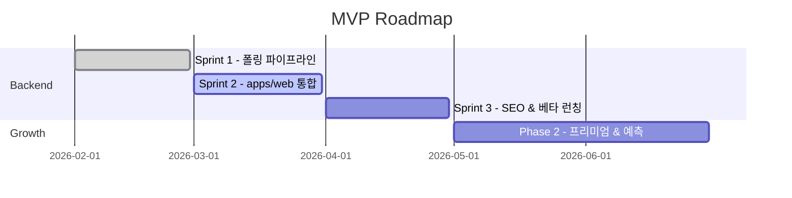

# 신혼여행 특화 '빈방 알림 + 가격 변동 추적' 플랫폼 — MVP 사업화 실행계획

## Executive Summary

신혼여행은 "날짜가 고정되고(변경 비용이 큼)", "원하는 숙소·룸타입이 뚜렷하며", "무료취소·가격변동으로 재고가 들쭉날쭉"해 **'취소분/가격하락을 놓치지 않는 즉시성'**이 곧 가치가 되는 시장이다.

이 계획은 Agoda Search API를 활용해 특정 날짜·특정 숙소를 **지속 모니터링 → 변화 감지 → 알림**으로 연결하고, 동시에 가격 히스토리를 축적해 "기다릴지/지금 예약할지" 판단을 돕는다.

**플랫폼 결정**: 독립 앱(apps/mooncatch) 대신 **apps/web에 통합**한다. apps/web은 이미 NextAuth 기반 사용자 인증, PostgreSQL DB(`agoda_hotels` 포함), 배포 인프라를 갖추고 있어 중복 투자를 피할 수 있다. apps/mooncatch의 폴링/감지/알림 서비스는 apps/web으로 이식되며, mooncatch는 eventually 제거된다.

수익화는 (A) 제휴(레퍼럴) 기반 + (B) 프리미엄(빠른 알림·고급 추적·다중 채널)으로 이원화하며, 12개월 목표는 **월 2.5만 SEO 세션 · 알림등록 12% · 알림등록→예약 3%** 가정으로 월 90건 예약 전환 시 제휴 매출만으로 월 360만원 수준을 노린다.

권장 액션:
1. 상위 3개 목적지(몰디브/발리/칸쿤)에만 MVP를 제한
2. **가격 하락 알림**을 1순위로 출시 (실제 API에서 `remainingRooms` 미반환 확인 — 아래 참조)
3. 첫 4주에 "정확도(오탐/미탐)"를 계량화해 신뢰를 먼저 만든다

---

## 목표와 가정

**목표(트래픽·전환·수익 목표: 3개월/6개월/12개월)**

| 기간 | 월 SEO 세션 | 세션→알림등록 | 알림등록→예약 | 예약건수 | 제휴 수익(40,000원/건 가정) | 프리미엄 수익(9,900원/월) | 월 합계 |
|---|---:|---:|---:|---:|---:|---:|---:|
| 3개월 | 3,000 | 8% | 1.5% | 4 | 144,000원 | 0원(미출시) | 144,000원 |
| 6개월 | 10,000 | 10% | 2% | 20 | 800,000원 | 49,500원(0.5% 유료) | 849,500원 |
| 12개월 | 25,000 | 12% | 3% | 90 | 3,600,000원 | 297,000원(1% 유료) | 3,897,000원 |

- "예약 1건당 평균 수익 40,000원"과 전환율은 **가정**이며, 실제 커미션·어트리뷰션은 운영 초기에 측정으로 보정해야 한다.
- Agoda API 응답에 `estimatedCommission` 항목이 존재하지만 별도 협의(기술팀 문의) 필요 → 초기엔 대시보드/정산 데이터 기반으로 교정.

**우선순위 가정**

| 우선순위 | 항목 | 값 | 비고 |
|---|---|---|---|
| P0 | 월 목표 순이익 | 3,000,000원 | 사용자 목표 |
| P0 | 초기 포커스 지역 | 몰디브/발리/칸쿤 | 국내 허니문 통계 상위 목적지 |
| P0 | 핵심 KPI | 세션→알림등록→예약 | Agoda API로 가격·취소정책 변화 감지 가능 |
| P1 | 1건당 평균 수익 | 40,000원(가정) | 프로그램/객단가에 따라 변동 |
| P1 | 세션→알림등록 전환율 | 8~12%(가정) | '만실 해결' 니즈가 명확할 때 높은 전환 |
| P1 | 알림등록→예약 전환율 | 1.5~3%(가정) | 알림을 등록한 사용자는 구매 의도가 높다는 가정 |
| P2 | 프리미엄 과금 전환 | 0.5~1%(가정) | 신뢰 확보 후 도입 |

권장 액션:
- 전환율 가정을 **2주 단위로 실측치로 교체**(세션/알림등록/예약·정산)
- 상위 3개 목적지의 "만실 문제 강도가 높은 상위 20개 리조트"만 먼저 다룬다
- `clickref/orderRef` 같은 추적 파라미터 체계를 먼저 확정한다

---

## 핵심 가치 제안과 타깃

**핵심 가치 제안**

이 MVP의 본질은 "추천"이 아니라 **'변화 감지(Change Detection) + 즉시 알림'**이다.

- **가격 하락 알림**: `dailyRate`를 주기적으로 저장해 "현재가 vs 과거 최저가" 비교 후 일정 비율(기본 10%) 이하로 떨어지면 알림 발송 → **Sprint 1에서 구현 완료, 실제 동작 확인**
- **빈방 알림(취소분 포착)**: `remainingRooms` 0→양수 변화 감지 → **실측에서 해당 필드가 NULL로 반환됨** (아래 "Sprint 1 실측 결과" 참조). Agoda 계정 매니저에게 `rateDetail` extra 지원 여부 확인 필요
- **취소 정책을 '알림 로직'에 반영**: `cancellationPolicy` 기반으로 "무료취소 마감 임박 구간"에 폴링 빈도를 높여 승률·체감가치를 올린다

**타깃 페르소나**

| 페르소나 | 상황/맥락 | 주요 Pain | MVP가 주는 가치 |
|---|---|---|---|
| D-365 플래너형 신혼부부 | 6~12개월 전부터 인기 리조트 확보 | 만실로 선택지 없음 | 특정 숙소·룸타입 추가 → 취소분 즉시 알림 |
| D-60~D-7 막판 확정형 | 휴가/예식 일정 확정 지연 | 남은 기간 내 만실, 마감 직전 취소분 경쟁 | 마감 임박 집중 모니터링 + 즉시 결제 준비 |
| 허니문 상담/동행형(소규모 B2B) | 지인/고객 숙소를 대신 찾아주는 역할 | 여러 커플 숙소 동시 추적 | 내 호텔 목록 일괄 관리, 알림 히스토리 제공 |

- 신혼여행은 자유여행 선호가 높으므로 "여행사 패키지"가 아닌 "직접 예약(OTA/제휴)" 흐름으로 연결될 가능성이 높다
- 리조트·성수기 취소 규정은 '도착일 기준 15~45일 전'처럼 길게 설정되는 사례가 많아 "마감 임박 구간" 집중 설계가 설득력 있다

권장 액션:
- 랜딩에서 **"알림 1분 설정"**만 먼저 완성(계정/로그인 최소화)
- 호텔 추가 시 "무료취소 마감일"을 **자동 계산/표시**
- D-365/D-30/D-7 시나리오별 알림 UX(빈도, 채널, 문구)를 분리해 A/B 테스트

---

## Sprint 1 실측 결과 (2026-02-26 기준)

Sprint 1에서 실제 Agoda Search API를 호출해 확인한 결과:

| 항목 | 예상 | 실측 결과 |
|---|---|---|
| `remainingRooms` | 잔여 객실 수 반환 | **NULL** (기본 API 응답에 미포함) |
| `dailyRate` | 일별 요금 | **정상 반환** (예: $112.83) |
| `totalInclusive` | 총 포함 금액 | 최초 경로 누락 → `dailyRate` fallback 추가로 해결 |
| `freeCancellation` | 무료취소 여부 | 정상 반환 |
| API 응답 속도 | — | P95 약 2~3초 (waitTime=20) |

**`remainingRooms` NULL 대응 전략**:
- **Option A** (현재 채택): 가격 하락(`price_drop`)을 1차 알림 신호로 사용, `remainingRooms`는 보조 신호
- **Option B**: Agoda 계정 매니저에게 `rateDetail` extra 지원 여부 확인 후 활성화
- **Option C**: 오퍼 존재/소멸 패턴으로 vacancy를 간접 추정 (추후)

모든 폴링 파이프라인(polling → snapshot → detection → notification)은 Sprint 1에서 구현·테스트 완료.

---

## 경쟁 환경과 차별화

**경쟁 분석**

| 범주/서비스 | 기능 | 장점 | 단점/빈틈 | 우리의 차별 포인트 |
|---|---|---|---|---|
| Google 호텔 가격 추적 | 가격이 내려가면 이메일 알림 | 광범위 커버리지, 설정 쉬움 | 특정 룸타입/취소분(재고)보다 "가격" 중심 | 가격뿐 아니라 "오퍼 오픈" 알림 + 허니문 체크리스트 UX |
| KAYAK 가격 알림 | 호텔 요금 하락 알림(주/일 단위) | 가격 모니터링 UX 성숙 | 신혼여행 특화(날짜 고정/특정 리조트) 설계 약함 | 리조트별 "취소 마감일·취소분 패턴" 전용 UI |
| Hopper 가격 예측/모니터링 | 특정 호텔 가격 예측·추적 | 가격 예측/모니터링 전면 | 강력한 데이터/모델 필요 (1인 MVP 모방 어려움) | 초기엔 "히스토리+단순 룰" 로 실용성 확보 |
| Open Hotel Alert | 빈방 생기면 알림, Booking.com 기반 | 니즈가 정확히 동일 | 범용 서비스, 국내 UX 미지정 | 한국 신혼부부 대상, 허니문 리조트 DB·가이드 결합 |
| Hotel Pounce | Sold-out 호텔 Available 시 알림 | 니즈 직격 | 범용 서비스로 차별화 어려움 | "허니문 전용" + "취소정책 기반 빈도 조절" |
| 커뮤니티/블로그 관행 | "취소분은 반드시 발생", 수동 체크 팁 | 사용자가 이미 '행동'을 하고 있음 | 수동 체크가 번거롭고 실시간성 떨어짐 | 수동 행동을 자동화(모니터링/알림/로그) |

**핵심 차별화 요약**:
- "가격 알림" 경쟁은 치열하므로 MVP는 **가격 하락 알림(dailyRate 기반)**을 우선 출시
- "허니문" 맥락을 UI/콘텐츠에 녹여 정보 비대칭(취소 마감·패키지 구성·추가 비용)을 줄인다

---

## 데이터·서빙·알림·AI 설계

**Agoda API 활용 방식**

- 인증: 모든 요청에 `Authorization: siteId:apiKey` 헤더 필수
- `propertyIds`: 요청당 최대 100개 호텔 지원 → 같은 날짜·인원 조건인 호텔끼리 배치 가능
- `waitTime`: 길게 줄수록 더 많은 availability 옵션 반환 (현재 폴링: 20초, verify: 8초)
- `dailyRate` extra: 날짜별 요금 저장 → 가격 히스토리 핵심
- `cancellationDetail` extra: 취소정책 상세 반환
- `rateDetail` extra: `remainingRooms` 반환 예정이지만 현재 계정에서 미작동 (확인 필요)

**폴링 빈도 (초기 가정)**

- 기본: Watch 1개당 30분 간격(무료), 10~15분 간격(프리미엄)
- 가중: "무료취소 마감 임박(7~3일 전)" 구간에서 3~5분 간격(프리미엄)
- 배치 최적화: 같은 체크인/아웃 조건의 Watch는 1번 API 호출로 묶어 처리 (Phase 2)

**스냅샷 저장 구조 (실제 구현 기준)**

```json
{
  "polledAt": "2026-02-25T13:05:00+09:00",
  "propertyId": 12157,
  "checkIn": "2026-11-10",
  "checkOut": "2026-11-14",
  "currency": "USD",
  "rooms": [
    {
      "roomId": 3134583,
      "ratePlanId": 617128,
      "remainingRooms": null,
      "freeCancellation": true,
      "dailyRate": 112.83,
      "cancellationPolicy": {"code": "...", "cancellationText": "..."}
    }
  ]
}
```

**MVP 기능 목록 및 우선순위**

| 구분 | 기능 | 설명 | 상태 |
|---|---|---|---|
| 필수 | 알림 등록 (호텔 검색·날짜 선택) | 호텔 검색 → "가격 하락/빈방 알려줘" | Sprint 2 (apps/web) |
| 필수 | 가격 하락 알림 | dailyRate 변화(-10% 이상) 감지 후 이메일 | ✅ Sprint 1 완료 |
| 필수 | 폴링 파이프라인 | 스냅샷 저장 → 변화 감지 → 알림 큐 | ✅ Sprint 1 완료 |
| 필수 | 중복/스팸 방지 | 동일 이벤트 dedupe (event_key unique) | ✅ Sprint 1 완료 |
| 필수 | 수신동의/수신거부/로그 | 법 준수 (정보통신망법 제50조) | Sprint 2 |
| 추가 | 빈방 알림 | remainingRooms 0→양수 감지 | Agoda 확인 후 |
| 추가 | 가격 히스토리 | 7일/30일 최저가 대비 현재가 표시 | Sprint 2 |
| 추가 | 다중 채널 (카카오/푸시) | 수신 동의/수신거부 완성 후 | Phase 2 |
| 향후 | 취소 확률/가격 예측 | ML 기반 "기다릴 확률" | 데이터 3~6개월 누적 후 |

**기술 아키텍처 (apps/web 통합 기준)**

```mermaid
graph LR
  U[User] --> W[apps/web Next.js]
  W --> AUTH[NextAuth 세션]
  W --> HOTEL[호텔 검색 API<br/>agoda_hotels DB]
  W --> ACC[알림 등록/관리 API<br/>accommodations]
  ACC --> DB[(PostgreSQL)]

  subgraph "폴링 파이프라인 (apps/web internal API)"
    CRON[BullMQ Repeat Job<br/>매 30분] --> POLL[POST /api/internal/accommodations/poll-due]
    POLL --> SVC[폴링 서비스]
    SVC --> AGODA[Agoda Search API]
    SVC --> DB
    SVC --> EVT[변화 감지]
    EVT --> NQ[notification 큐 (DB)]
    NQ --> MAIL[이메일 발송]
  end

  DB --> ADMIN[관리자 페이지]
```

- **BullMQ Repeat Job**: Worker의 scheduler에 등록 → `mooncatch-poll-due`, `mooncatch-dispatch`, `mooncatch-snapshot-cleanup`
- **apps/worker**: 브라우저 스크래핑 전용 (Agoda 폴링과 무관)
- **내부 API 인증**: `x-internal-token` 헤더로 외부 호출 차단

**DB 설계 (Sprint 2 기준)**

기존 `Accommodation` 테이블을 확장해 Agoda API 모니터링을 통합. 별도 테이블 없음.

| 테이블 | 역할 | 주요 컬럼 |
|---|---|---|
| users | 사용자 (NextAuth) | id, email, created_at |
| consent_logs | 수신동의/철회 증적 | id, user_id, type, timestamp, ip |
| agoda_hotels | 호텔 마스터 (Agoda Content API) | property_id(BIGINT), name, country, city |
| accommodations | 알림 등록 단위 | id, user_id, platform, platform_id, url(nullable), check_in, check_out, rooms, adults, children, currency, locale, is_active, last_polled_at, last_event_at |
| poll_runs | 폴링 실행 로그 | id, accommodation_id, polled_at, http_status, latency_ms, error |
| room_snapshots | 결과 스냅샷 | id, poll_run_id, room_id, rate_plan_id, remaining_rooms, total_inclusive, payload_hash, raw |
| alert_events | 변화 이벤트 | id, accommodation_id, type(vacancy/price_drop), event_key(unique), status, before_hash, after_hash |
| notifications | 발송 상태 | id, alert_event_id, channel, status, attempt, sent_at |

- `platform = AGODA` + `platformId` 있음 → Agoda API 폴링 (일반 사용자)
- `platform = AIRBNB` or `url` 있음 → 스크래핑 (어드민 전용)

**알림 시스템 설계 (이벤트 흐름)**



- **dedupe 키**: `event_key = (accommodation_id, type, after_hash)` → 동일 변화 1회만 발송
- **재시도**: 외부 발송 실패 시 지수 백오프 (즉시→1분→5분→30분, 최대 4회)
- **스팸 방지**: 체크박스 기반 명시적 동의 + 원클릭 수신거부 + 증적 로그 (정보통신망법 제50조)

**AI 활용 포인트**

1인 MVP에서 AI는 **효율(폴링 최적화)과 문구/UX 품질**을 높이는 도구로 배치한다.

- **취소 확률 예측 (Heuristic → ML)**:
  - 1차: 무료취소 마감 D-7~D-1 구간 가중, 과거 동일 숙소·시즌의 "오픈 이벤트 빈도" 가중
  - 2차: 데이터 누적 후 Gradient Boosting 등으로 확장
- **가격 예측**: MVP에선 예측 대신 "최근 7/30일 분포, 최저가 대비 현재가 위치" 같은 설명 가능한 지표 우선
- **추천 문구 (LLM)**: "지금 예약/기다리기" 단정 대신 근거 기반 문장 자동 생성
  - "무료취소 마감까지 X일 남음"
  - "최근 30일 중 최저가 대비 +Y%"
  - "최근 72시간 내 가격 변동 Z회"

---

## 실행·성장·수익화

**SEO·콘텐츠 전략**

초기 SEO는 **프로그램형 페이지(Programmatic SEO)**가 유리하다. `agoda_hotels` DB를 이미 갖고 있고, "가격 변동"이라는 시간에 따라 업데이트되는 신호가 페이지를 차별화하기 때문이다.

| 키워드군 | 검색 의도 | 목표 페이지 |
|---|---|---|
| "몰디브 신혼여행 리조트 추천/순위" | 탐색 (상위 퍼널) | /honeymoon/maldives |
| "몰디브 ○○리조트 빈방/취소분/예약" | 고의도 (중/하위 퍼널) | /honeymoon/maldives/{resort-slug} |
| "신혼여행 숙소 무료취소/재예약" | 문제 해결 (교육) | /guides/free-cancel-rebook |
| "○○리조트 가격 변동/최저가" | 검증/확신 | /honeymoon/{resort}/price-history |

페이지 구성 요소:
- 헤더: "○○리조트 신혼여행 | 빈방 알림/가격 추적"
- "다음 무료취소 마감: YYYY-MM-DD (숙소 타임존 기준)"
- "최근 72시간 가격 변동: N회"
- "4박 총액 추이 (최근 30일)"
- CTA: "가격 하락 시 이메일로 받기 (1분)"

**수익모델**

- **무료 (0원)**: 알림 등록 3개, 30분 폴링, 이메일 알림, 가격 히스토리 7일
- **프리미엄 (월 9,900원)**: 알림 등록 무제한, "무료취소 임박 구간" 5분 폴링, 가격 하락 알림, 알림 우선순위 큐, (선택) 카카오/문자
- **원샷 (1회 4,900원)**: 신혼여행 1개 여정에 대해 30일 집중 모니터링

수익 시뮬레이션 (월 기준):

| 항목 | 보수적 | 기준 | 공격적 |
|---|---:|---:|---:|
| 월 SEO 세션 | 12,000 | 25,000 | 40,000 |
| 세션→알림 등록 | 8% | 12% | 15% |
| 알림 등록→예약 | 2% | 3% | 4% |
| 제휴 1건당 수익 | 25,000원 | 40,000원 | 50,000원 |
| 월 제휴 매출 | 480,000원 | 3,600,000원 | 12,000,000원 |
| 프리미엄 전환 | 0.5% | 1% | 2% |
| 프리미엄 월 매출 | 47,520원 | 297,000원 | 1,188,000원 |
| **월 합계** | **527,520원** | **3,897,000원** | **13,188,000원** |

**KPI와 측정방법**

- 상위 퍼널: SEO 세션, 목적지 페이지 CTR, 알림 CTA 클릭률
- 핵심 퍼널: 알림 등록 전환율, 알림 등록 활성율(7일 내 1회 이상 폴링 성공), 알림 도달률/오픈률/클릭률
- 수익: 클릭아웃 수, 예약 수, 승인/보류/거절 비율
- 품질: 오탐률, 미탐률, P95 알림 지연, API 실패율

**MVP 로드맵**

| 단계 | 기간 | 핵심 작업 | 상태 |
|---|---|---|---|
| Sprint 1 | 2026-02 | 폴링·스냅샷·변화 감지·알림 파이프라인 (mooncatch) | ✅ 완료 |
| Sprint 2 | 2026-03 | apps/web 통합 — 호텔 검색 UI, 알림 등록, 내부 API 이식 | ✅ 완료 |
| Sprint 3 | 2026-04 | SEO 페이지 템플릿, 가격 히스토리, 수신동의/수신거부, 베타 런칭 | 📋 예정 |
| Phase 2 | 2026-05+ | 프리미엄 과금, 다중 채널, 취소 확률 예측, 커뮤니티 마케팅 | 📋 예정 |



**리스크·대응책**

| 리스크 | 대응책 |
|---|---|
| `remainingRooms` 미반환 | 가격 하락을 1차 신호로, Agoda 계정 매니저에게 `rateDetail` 지원 확인 |
| API 호출 폭증 | `propertyIds` 배치(최대 100), 같은 날짜 조건 알림 등록끼리 묶기, concurrency=3 |
| 오탐으로 신뢰 붕괴 | 변화 감지 후 1회 verify re-check, "예약 가능성은 실시간 변동" 고지 |
| 스팸/법 위반 | 명시적 동의/원클릭 수신거부/증적 로그 (정보통신망법 제50조, KISA 안내 기준) |
| SEO 의존 리스크 | 커뮤니티/케이스 스터디 유입 병행, 알고리즘 변동 리스크 분산 |
| apps/web 코드베이스 복잡도 증가 | 모듈 경계를 명확히 (서비스 레이어 분리), Accommodation 확장은 마이그레이션 1회로 처리 |

**실행 체크리스트**

| 우선순위 | 액션 | 완료 기준 |
|---|---|---|
| P0 | 목적지 3개 + 리조트 60개 리스트 확정 | slug/ID 맵핑 완료 |
| P0 | apps/web — 호텔 검색 API (agoda_hotels DB) | 검색 결과 반환 |
| P0 | apps/web — 알림 등록 API (NextAuth userId, platform=AGODA) | Accommodation DB 저장 성공 |
| P0 | apps/web — Vercel Cron + /api/internal/accommodations/poll-due | 30분마다 자동 폴링 |
| P0 | 수신동의/수신거부/로그 | 철회 즉시 반영, 증적 저장 |
| P1 | 가격 히스토리 30일 저장/표시 | per-day 저장·비교 가능 |
| P1 | SEO 페이지 템플릿 (목적지/숙소) | 20~50개 페이지 공개 |
| P1 | 커미션/정산 추적 (clickref/orderRef) | 수익 모델 검증 |
| P2 | 프리미엄 과금 (빠른 알림) | 실제 결제 10건 확보 |
| P2 | Agoda 계정 매니저 — `remainingRooms` 지원 확인 | 빈방 알림 활성화 여부 결정 |

권장 액션:
- 4주 MVP의 "성공 정의"를 **예약건수**가 아니라 **오탐/미탐·알림 지연** 같은 품질 지표로 잡고, 6~12주에 전환 최적화로 넘어간다
- SEO는 목적지/숙소 페이지를 먼저 만들고, 가이드 글은 그 다음(콘텐츠 생산 부담 최소화)
- 제휴는 1곳(Agoda 파트너)으로 고정해 MVP 단계 복잡성을 제어한다
